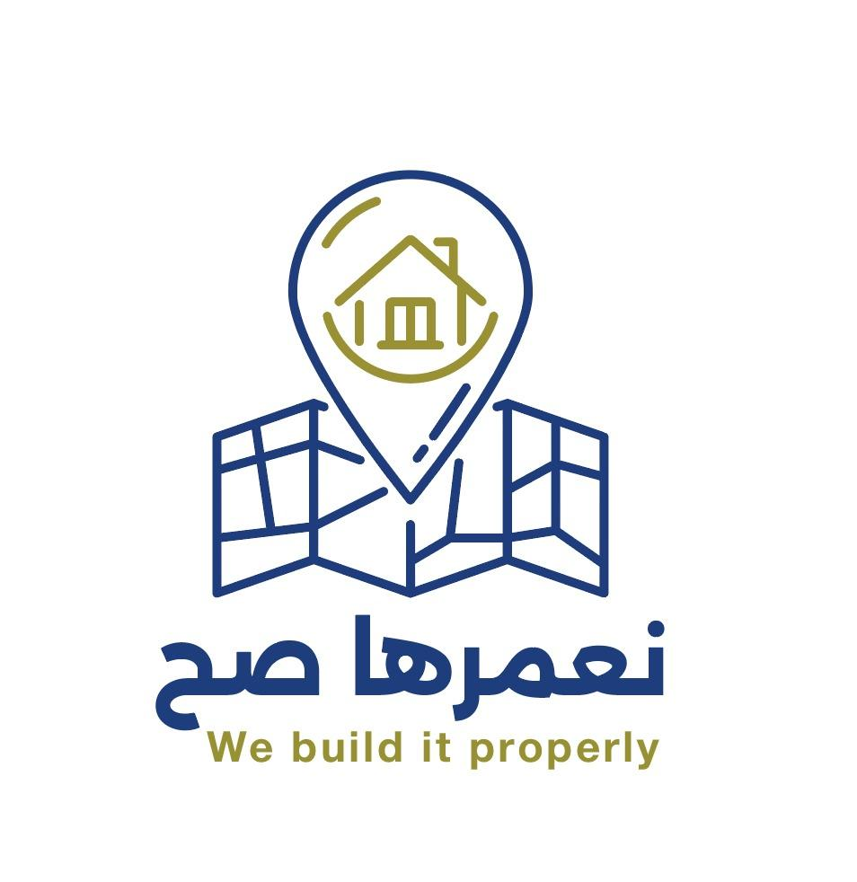

# نعمرها صح (Namerha Sah) - نظام البلاغات الخدمية



**"نعمرها صح"** هو منصة رقمية متكاملة لرفع كفاءة الاستجابة للمشاكل الخدمية والبنية التحتية. يربط النظام بين المواطنين (عبر تطبيق موبايل) والجهات التشغيلية والتنفيذية (عبر لوحة تحكم إدارية).

## ✨ المميزات الرئيسية
* **تطبيق المواطن (Flutter):** إمكانية رفع البلاغات، تحديد الموقع بدقة، ورفع الصور مع إمكانية العمل لاحقاً دون اتصال (Offline-first architecture).
* **لوحة التحكم المركزية (Laravel):** إدارة البلاغات، تحويل المهام، الاعتمادات المالية، ومراقبة مؤشرات الأداء (KPIs).
* **البنية المكانية (GIS):** نظام متقدم يعتمد على `S2 Geometry` و `PostGIS` للفهرسة الجغرافية السريعة.

---

## 🛠 التقنيات المستخدمة
* **الواجهة الخلفية (Backend):** Laravel 11, PHP 8.2, Sanctum Auth.
* **الواجهة الأمامية (Frontend):** Flutter, Dart.
* **قاعدة البيانات:** PostgreSQL مع إضافة PostGIS.
* **الخرائط والمواقع:** Leaflet.js للوحة التحكم، وحزمة S2 Geometry.

---

## 🚀 تشغيل المشروع (Backend)

1. **تثبيت الحزم:**
   ```bash
   composer install
   npm install
   ```

2. **إعداد قاعدة البيانات:**
   قم بنسخ ملف البيئة وضبط بيانات قاعدة البيانات PostgreSQL:
   ```bash
   cp .env.example .env
   php artisan key:generate
   php artisan migrate
   ```

3. **تشغيل السيرفر:**
   ```bash
   php artisan serve
   ```

---

## 📚 توثيق واجهات برمجة التطبيقات (API Documentation)
تم توثيق كافة الـ APIs باستخدام **Swagger (OpenAPI)** لتسهيل عملية التكامل والربط للجهات والمطورين.

بعد تشغيل السيرفر، يمكنك الوصول لصفحة التوثيق التفاعلية عبر الرابط:
**`http://localhost:8000/api/documentation`**

*ملاحظة: يمكنك إعادة توليد التوثيق بعد أي تعديل عبر الأمر:*
```bash
php artisan l5-swagger:generate
```

---

## 👥 فريق العمل
تم تطوير هذا النظام بواسطة **فريق البنية التحتية 2**.
